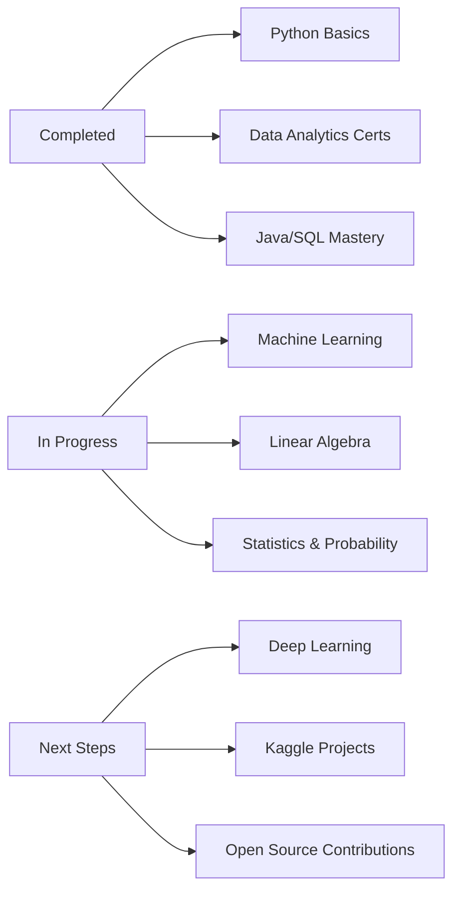

# Hi, I'm Yusra Batool

### Computer Science Student | Data Analytics Enthusiast | Aspiring ML Engineer

*Transforming data into insights • Building with purpose • Learning by doing*

---

##  About Me

I'm a **Computer Science undergraduate at Sukkur IBA University** (GPA: 3.7/4.0) with a passion for **data analytics, machine learning, and building impactful software solutions**. I believe in learning through real-world projects and turning complex problems into elegant solutions.

-  **Harvard Aspire Leaders Program 2025** – Top 21% globally (9,362 of 45,228 applicants from 180+ countries)
-  Currently mastering **Data Analytics** through IBM and Google Professional Certificates
-  Building scalable applications with **Java, Python, SQL** and exploring **Machine Learning**
-  Deepening my knowledge in **Linear Algebra, Statistics, and AI**
-  **Goal**: Land a remote data analyst/ML role by 2026 and contribute to open-source projects
-  **Current Focus**: Completing data analytics projects on Kaggle and building my ML portfolio

---

##  Achievements & Recognition

| Achievement | Details |
|------------|---------|
|  **Harvard Aspire Leaders Program 2025** | Selected among top 21% globally (9,362 finalists from 45,228 applicants across 180+ countries) |
|  **Class High Achiever** | Maintaining strong GPA with excellence in CS and Mathematics courses |
|  **AI & CS Expo 2024** | Showcased educational AI project to 200+ attendees |
|  **CS & AI Society Member** | Active contributor to research discussions and tech innovation initiatives |
|  **McKinsey & Company Forward Program** | Completed professional development certification |

---

##  Professional Certifications

### Data Analytics & Cloud

### Programming & Development
[-00EA64?style=for-the-badge&logo=hackerrank&logoColor=white)]()
[-00EA64?style=for-the-badge&logo=hackerrank&logoColor=white)]()

### Leadership & Business

---

##  Technical Skills

### Languages

### Data Analytics & Visualization

### Databases & Cloud

### Development Tools & Methodologies

### Concepts & Domain Knowledge
- **Core CS**: OOP, Data Structures, Algorithms, Software Engineering, Computer Networks
- **Data Science**: Statistical Analysis, Data Visualization, Exploratory Data Analysis (EDA)
- **AI & ML**: Machine Learning Fundamentals, Generative AI, AI Ethics
- **Mathematics**: Linear Algebra, Calculus, Statistics, Probability
- **Development**: REST APIs, CRUD Operations, Database Design, System Architecture

---

<!--
##  Featured Projects

###  Learning Management System (LMS) | *Spring 2025*
**Tech Stack**: Java (Swing, JDBC) • SQL • MVC Architecture

- Built a scalable educational platform serving **100+ users** with role-based access control
- Reduced administrative workflow time by **40%** through automated CRUD operations
- Implemented secure data architecture with comprehensive error handling
- **Impact**: Streamlined course management for students and faculty

[🔗 View Project](#) | [📄 Documentation](#)

---

###  Vocabulary Builder Game | *Fall 2024*
**Tech Stack**: Java • Agile Methodology • Game Design

- Led **5-person team** to develop gamified learning app using Agile sprints
- Achieved **85% user engagement rate** and **30% vocabulary retention improvement** in pilot study
- Designed adaptive difficulty system based on user performance
- **Impact**: Made language learning interactive and measurable

[🔗 View Project](#) | [📄 Documentation](#)

---

###  Data Analytics Research Projects | *Aug 2024 - Present*
**Tech Stack**: Python (Pandas, NumPy) • R • SQL • Tableau

- Analyzed education datasets with **1000+ records** to identify learning patterns and trends
- Created **12+ interactive dashboards** for stakeholder decision-making
- Applied statistical methods for hypothesis testing and correlation analysis
- **Impact**: Provided actionable insights for educational program improvements

[ View Notebooks](#) | [ Tableau Dashboards](#)

---

###  Deloitte Data Analytics Job Simulation | *Summer 2025*
**Tech Stack**: Excel • Tableau • Data Visualization

- Completed comprehensive job simulation focusing on forensic technology and data analysis
- Designed professional dashboards to visualize complex business datasets
- Applied Excel analytics to classify data, identify trends, and derive business conclusions
- **Impact**: Demonstrated real-world data analysis capabilities for consulting scenarios

[ View Simulation](#)

---
--->
##  Education

**Bachelor of Science in Computer Science**  
*Sukkur IBA University, Pakistan* | Expected Graduation: June 2028  
**GPA**: 3.7 / 4.0

<!--
**Relevant Coursework**:
- **Core CS**: Object-Oriented Programming, Data Structures, Algorithms, Software Engineering
- **Systems**: Computer Networks, Digital Logic Design, Database Systems
- **Mathematics**: Linear Algebra, Calculus, Discrete Structures, Statistics & Probability
- **AI & Data**: Artificial Intelligence, Data Analytics, Machine Learning (upcoming)

**Current Semester (Spring 2025)**: Computer Organization, Theory of Automata, Advanced DBMS, Artificial Intelligence, Information Security, Probability & Statistics

---

##  GitHub Statistics

---

##  GitHub Achievements

---

##  Current Learning Journey

---

##  What I'm Currently Working On

-  Mastering **Python** for data science (completing BroCode course)
-  Learning **Linear Algebra** and **Statistics** for ML foundations
-  Building real-world **data analytics projects** on Kaggle
-  Preparing for **Machine Learning** projects (Q2 2025)
-  Contributing to **open-source** data science projects

---

##  2026 Goals

- [ ] Complete 3-5 high-quality **data analytics projects** on Kaggle
- [ ] Master **Machine Learning** fundamentals and build ML portfolio
- [ ] Contribute to **open-source** data science projects
- [ ] Land a **remote data analyst internship**
- [ ] Participate in **Kaggle competitions** and earn medals
- [ ] Build **end-to-end ML projects** with deployment

---
--->
##  Let's Connect!

I'm always open to collaborating on data analytics and ML projects, discussing tech, or just connecting with fellow learners!

---

###  *"The best way to predict the future is to create it."* – Peter Drucker

---

** Fun Facts About Me**
-  From Sukkur, Pakistan 🇵🇰
-  Avid learner with 10+ professional certifications
-  Passionate about using data to solve real-world problems
-  Love collaborating on Agile projects
-  Believe in learning by doing, not just watching tutorials

---

<!--

**Thanks for visiting! Feel free to explore my projects and reach out for collaborations.** 🚀
--->

<!-- Crafted with 💜 by Yusra Batool | Last Updated: January 2026 -->
